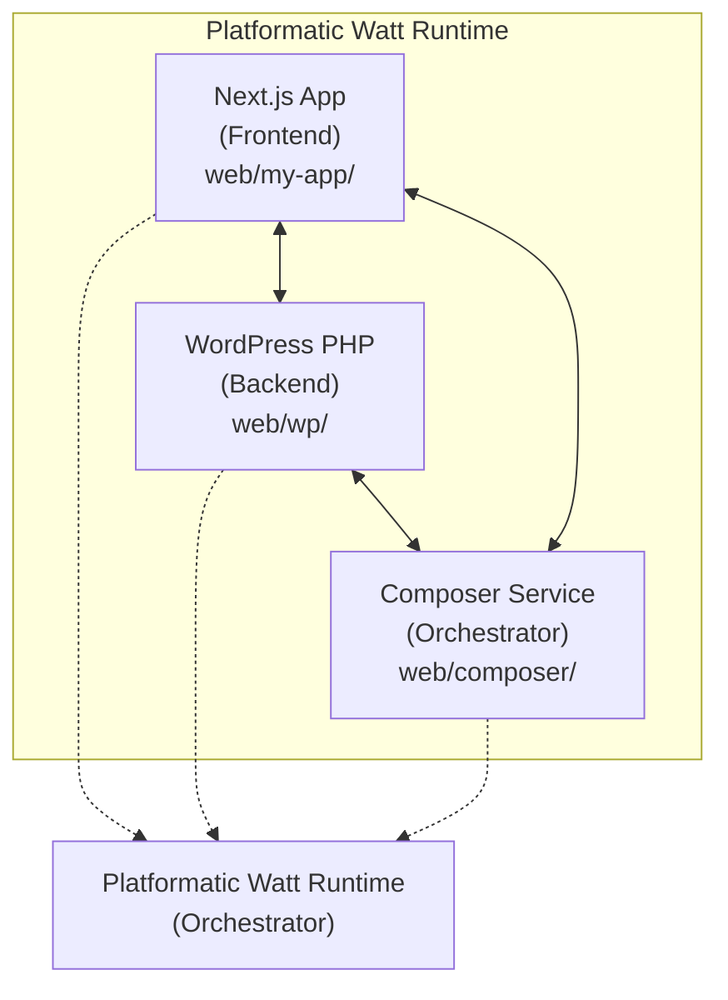
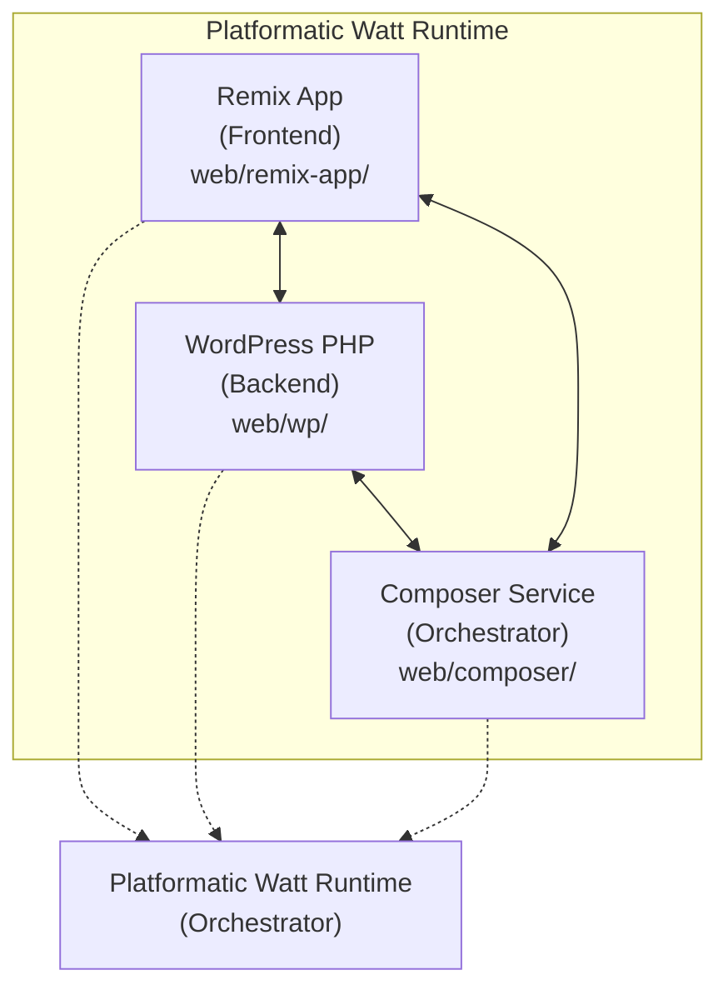

# Watt WordPress Remix App - Design Document

## Overview

This document outlines the design for creating a **Watt WordPress Remix app** based on the [platformatic/watt-next-wordpress](https://github.com/platformatic/watt-next-wordpress) reference implementation, replacing Next.js with Remix (React Router 7) while maintaining the same microservices architecture and functionality.

## Architecture

### Current Architecture (Next.js Reference)
The reference implementation uses a three-service microservices architecture:



### Target Architecture (Remix)
We'll maintain the same three-service architecture but replace the Next.js frontend:



## Technology Stack

### Frontend (Remix/React Router 7)
- **Framework**: Remix v2 (React Router 7)
- **Runtime**: Node.js >= 22.14.0
- **Styling**: Tailwind CSS v4 (maintained from reference)
- **Language**: TypeScript (maintained from reference)
- **Build Tool**: Vite (Remix default)

### Backend Services (Unchanged)
- **WordPress**: Standard WordPress with Platformatic PHP runtime
- **Composer Service**: Platformatic Composer for API orchestration
- **Database**: MySQL via Docker
- **Orchestration**: Platformatic Watt Runtime

### Development Tools
- **Package Manager**: npm (workspace configuration)
- **CSS Processing**: PostCSS with Tailwind CSS
- **Type Checking**: TypeScript with strict configuration

## Project Structure

```
wp-remix/
├── design.md                           # This document
├── README.md                          # Project documentation
├── package.json                       # Root workspace configuration
├── watt.json                          # Watt runtime configuration
├── docker-compose.yml                 # MySQL database setup
└── web/
    ├── remix-app/                     # Remix frontend application
    │   ├── app/                       # Remix app directory
    │   │   ├── routes/                # File-based routing
    │   │   ├── components/            # Reusable React components
    │   │   ├── lib/                   # Utility functions
    │   │   └── root.tsx               # Root layout component
    │   ├── public/                    # Static assets
    │   ├── package.json               # Remix app dependencies
    │   ├── platformatic.json          # Platformatic configuration
    │   ├── postcss.config.js          # PostCSS configuration
    │   ├── tailwind.config.ts         # Tailwind CSS configuration
    │   ├── tsconfig.json              # TypeScript configuration
    │   └── vite.config.ts             # Vite configuration
    ├── wp/                            # WordPress backend (unchanged)
    │   ├── wp-content/
    │   ├── wp-config.php
    │   ├── package.json
    │   └── platformatic.json
    └── composer/                      # Composer service (unchanged)
        ├── global.d.ts
        ├── package.json
        └── platformatic.json
```

## Migration Strategy

### 1. Next.js to Remix Migration

#### Routing Migration
- **Next.js**: Pages Router (`pages/` directory)
- **Remix**: File-based routing in `app/routes/` directory
- **Migration**: Convert page components to Remix route modules with loaders/actions

#### Data Loading Migration
- **Next.js**: `getServerSideProps`, `getStaticProps`, `useEffect` + `fetch`
- **Remix**: `loader` functions, `useLoaderData` hook
- **Migration**: Convert data fetching to Remix loaders for server-side data loading

#### Form Handling Migration
- **Next.js**: API routes + client-side form handling
- **Remix**: `action` functions with progressive enhancement
- **Migration**: Convert form submissions to use Remix actions

### 2. Configuration Migration

#### Build Configuration
- **From**: `next.config.ts` with custom configurations
- **To**: `vite.config.ts` with Remix preset
- **Migration**: Translate Next.js build settings to Vite equivalents

#### Styling Configuration (Maintained)
- **PostCSS**: Keep existing `postcss.config.mjs`
- **Tailwind**: Adapt `tailwind.config.ts` for Remix structure
- **CSS**: Maintain Tailwind CSS v4 setup

#### TypeScript Configuration
- **From**: Next.js TypeScript setup
- **To**: Remix TypeScript setup with proper types
- **Migration**: Update `tsconfig.json` and add Remix type definitions

## Key Implementation Details

### 1. Watt Runtime Configuration

The `watt.json` configuration will be updated to reflect the new frontend service:

```json
{
  "$schema": "https://schemas.watt.io/3.0.0.json",
  "applications": [
    {
      "id": "remix-app",
      "path": "./web/remix-app",
      "config": "platformatic.json"
    },
    {
      "id": "wp",
      "path": "./web/wp",
      "config": "platformatic.json"
    },
    {
      "id": "composer",
      "path": "./web/composer",
      "config": "platformatic.json"
    }
  ],
  "entrypoint": "remix-app",
  "web": {
    "hostname": "127.0.0.1",
    "port": "{PORT}"
  }
}
```

### 2. Service Communication

Services will communicate using the same patterns as the reference implementation:

- **Frontend ↔ Composer**: HTTP API calls via Platformatic Composer
- **Composer ↔ WordPress**: Direct API communication
- **Development**: All services run under single Watt runtime with service discovery

### 3. Remix-Specific Configurations

#### App Entry Point (`app/entry.server.tsx`)
```typescript
import { PassThrough } from "node:stream";
import type { AppLoadContext, EntryContext } from "@remix-run/node";
import { createReadableStreamFromReadable } from "@remix-run/node";
import { RemixServer } from "@remix-run/react";
import { renderToPipeableStream } from "react-dom/server";
```

#### Root Layout (`app/root.tsx`)
```typescript
import {
  Links,
  LiveReload,
  Meta,
  Outlet,
  Scripts,
  ScrollRestoration,
} from "@remix-run/react";
import type { LinksFunction } from "@remix-run/node";
import "./tailwind.css";
```

### 4. WordPress Integration

Maintain the same WordPress backend integration:

- **API Endpoints**: WordPress REST API through Composer service
- **Content Management**: Standard WordPress admin interface
- **Data Flow**: Remix loaders fetch data from WordPress via Composer API

## Development Workflow

### 1. Setup Process
1. **Initialize Watt Project**: `npm create wattpm`
2. **Configure Services**: Set up Remix app, maintain WordPress and Composer
3. **Database Setup**: Use existing Docker Compose MySQL configuration
4. **Install Dependencies**: Install Remix and related packages

### 2. Development Commands
```bash
# Start all services in development
npm start

# Individual service commands
npx wattpm remix-app:dev        # Start Remix dev server
npx wattpm wp:start            # Start WordPress service
npx wattpm composer:start      # Start Composer service

# Database operations
npx wattpm wp:db:setup         # Setup WordPress database
```

### 3. Build and Deployment
```bash
# Build all services
npm run build

# Production start
npm run start:prod
```

## Benefits of Remix Migration

### Performance Improvements
- **Server-Side Rendering**: Better SEO and initial page load performance
- **Progressive Enhancement**: Forms work without JavaScript
- **Optimistic UI**: Better user experience with optimistic updates
- **Route-Level Code Splitting**: Automatic code splitting per route

### Developer Experience
- **File-Based Routing**: Intuitive routing structure
- **Data Loading**: Simpler server-side data fetching patterns
- **Error Boundaries**: Better error handling at route level
- **Type Safety**: Improved TypeScript integration

### Modern React Patterns
- **React 18 Features**: Concurrent features, Suspense, etc.
- **Web Standards**: Leverages web platform APIs
- **Performance**: Better Core Web Vitals scores

## Migration Risks and Mitigation

### Risks
1. **Learning Curve**: Team familiarity with Remix patterns
2. **Third-Party Libraries**: Compatibility with existing Next.js-specific libraries
3. **Build Configuration**: Complexity in migrating build setup

### Mitigation Strategies
1. **Incremental Migration**: Start with simple pages, gradually migrate complex features
2. **Library Audit**: Identify and replace Next.js-specific dependencies
3. **Testing Strategy**: Comprehensive testing during migration
4. **Documentation**: Maintain detailed migration notes and patterns

## Success Criteria

### Functional Requirements
- [ ] All existing functionality preserved
- [ ] WordPress content management unchanged
- [ ] Same API endpoints and data flow
- [ ] Responsive design maintained
- [ ] Performance equivalent or better

### Technical Requirements
- [ ] TypeScript support maintained
- [ ] Tailwind CSS v4 styling preserved
- [ ] Development workflow preserved
- [ ] Build and deployment process working
- [ ] Service communication operational

### Performance Targets
- [ ] First Contentful Paint (FCP) ≤ 1.5s
- [ ] Largest Contentful Paint (LCP) ≤ 2.5s
- [ ] Cumulative Layout Shift (CLS) ≤ 0.1
- [ ] Time to Interactive (TTI) ≤ 3.0s

## Implementation Phases

### Phase 1: Project Setup
- [ ] Initialize Watt project structure
- [ ] Set up Remix application scaffold
- [ ] Configure build and development tools
- [ ] Establish service communication

### Phase 2: Core Migration
- [ ] Migrate basic routing structure
- [ ] Implement data loading patterns
- [ ] Convert components and styling
- [ ] Set up WordPress integration

### Phase 3: Feature Parity
- [ ] Migrate all existing features
- [ ] Implement form handling
- [ ] Add error boundaries and loading states
- [ ] Performance optimization

### Phase 4: Testing and Deployment
- [ ] Comprehensive testing
- [ ] Performance validation
- [ ] Documentation completion
- [ ] Deployment configuration

## Conclusion

This design provides a comprehensive roadmap for migrating from the Next.js-based `watt-next-wordpress` to a Remix-based implementation while preserving the benefits of the Platformatic Watt microservices architecture. The migration maintains all existing functionality while leveraging Remix's modern React patterns and performance benefits.

The phased approach ensures a systematic migration with clear milestones and success criteria, minimizing risks while maximizing the benefits of the modern Remix framework within the Watt ecosystem.